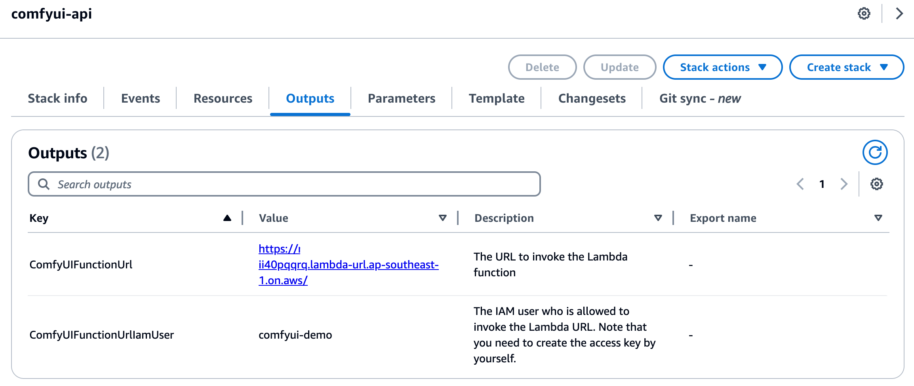
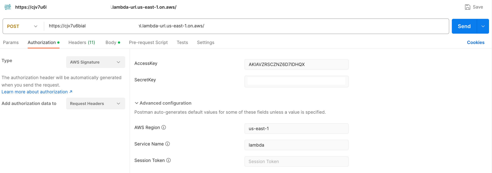

# ComfyUI on Amazon SageMaker
This project demonstrate how to pack ComfyUI into SageMaker and serve as SageMaker inference endpoint. It offers the following key features:
* Text-to-image functionality as a restful endpoint.
* Define the workflow as json for the lambda function, and provide the flexibility to extent to more features like image-to-image. 
* AWS SageMaker managed the underlining infrastructure for the image generation compute resources with optional auto scaling.

## Introduction
A simple restful api endpoint demo for text-to-image using ComfyUI in SageMaker and Lambda Function URL. 


## Deployment Guide
### Dependencies
Install the following dependencies on your EC2/Cloud9/local machine:
* awscli
* Docker
* (Optional) pigz

And configure the proper AWS credentials.

### Quick Start
Git clone the project to your environment:
```bash
git clone https://github.com/aws-samples/comfyui-on-amazon-sagemaker.git
```

Before you start the deployment, you can optionally customise the following:
* Resource naming in ./deploy.sh
* Model URL in ./model/build.sh
* ComfyUI workflow in ./lambda/workflow/workflow_api.json
Or just use the default values and run the following script for the deployment:
```bash
./deploy.sh
```
### Invoke the Restful Endpoint
The deploy.sh script may take 20 to 30 minutes to finish the deployment. The restful endpoint will be available from the Cloudformation stack's output.

We enable the AWS_IAM auth for invoking the lambda function URL by default, make sure you have a valid AWS credential to invoke the function URL.

Here is an example of using Postman with the given aws credentials:


And here is an example body:
```json
{"positive_prompt": "hill happy dog","negative_prompt": "hill","prompt_file": "workflow_api.json","seed": 1234}
```

The successful invocation will return the image to the frontend:


### Clean up
You can clean up the whole demo quickly by deleting the following resources created by `deploy.sh`:
1. Cloudformation stack. By default the stack name is `comfyui`.
1. S3 bucket. By default the s3 bucket name is `comfyui-sagemaker-${AWS_ACCOUNT_ID}-${AWS_DEFAULT_REGION}`.
1. ECR. By default the repo name is `${IMAGE_REGISTRY}/${IMAGE_REPO}`.


## Development Guide
You customise this demo to meet your requrement:
### ComfyUI's Version
Visit the official [ComfyUI git repository](https://github.com/comfyanonymous/ComfyUI) for getting the tag or commit id, and then update the [docker file](./image/Dockerfile.inference):
```yaml
# Git reference of ComfyUI (can be a branch name or commit id)
ARG COMFYUI_GIT_REF=master
```
Note that the lisense of ComfyUI is [GNU General Public Lisense 3.0](https://github.com/comfyanonymous/ComfyUI/blob/master/LICENSE).

### ComfyUI's Model/Plugin
ComfyUI loads models from its folder `ComfyUI/models`, and supports loading extra search paths by configuring `extra_model_paths.yaml`. We pack all the necessary models into a tar gzipped file and upload to S3. Then these files will be copied to `/opt/ml/model` by SageMaker, and can be used by ComfyUI inside inference container.

#### How to build
A sample build script is provided in `model/build.sh`, which downloads models from HuggingFace, creates tar gzipped file and uploads to S3. Modify it to fit your needs.
```sh
cd ./model

# sample build script to download model and upload to S3 for ComfyUI use in SageMaker
# modify variables for your environment and models you want to download
bash -x ./build.sh
```
Note that the `deploy.sh` will execute this script in the step.

### Docker Image for Packing ComfyUI
This section describes the Docker container that runs your inference code for hosting services. Read [AWS documentation](https://docs.aws.amazon.com/sagemaker/latest/dg/your-algorithms-inference-code.html) for more details.

#### Highlights of image
 - ComfyUI is running in container and listening on `127.0.0.1:8188`. The inference code will access to the local ComfyUI server by REST api and WebSocket.
 - The container has read-only access to `/opt/ml/model`, which SageMaker copies the model artifacts from S3 location to this directory. `extra_model_paths.yaml` of ComfyUI is configured to load models (such as CheckPoint, VAE, LoRA) from this path.
 - The container has a Flask server listening on port 8080 and accept `POST` requests to `/invocations` and `GET` requests to `/ping` endpoints.
 - Health Check (`GET` requests to `/ping`) is to check whether the local ComfyUI is still running and responding.
 - Inference Requests (`POST` requests to `/invocations`) is implemented by passing the payload to ComfyUI server. The payload is the same as used by ComfyUI GUI, in which the network traffics inspected in DevTools of browser.
   - Inference result is the image itself. If `Accept` header of the inference requests indicate jpeg is supported (e.g., `*/*`, `image/jpeg`), the output image will be converted to jpeg, else leave default as png.
 - Environment variables supported:
   - `JPEG_QUALITY` - Set between 0 to 95 for jpeg quality (default 90)
   - `DEBUG_HEADER` - Set to `true` to print HTTP header of requests in CloudWatch log
 

#### ComfyUI Inference Image
You can build the image using an EC2. You may use AMI `Deep Learning OSS Nvidia Driver AMI GPU PyTorch 2.0.1 (Amazon Linux 2)` but other AMI may also work.

1. Install and configure docker properly for your user.
```sh
# install docker if it does not come with AMI
sudo yum install -y docker
sudo systemctl enable docker.service
sudo systemctl start docker.service

# Add your user to the docker group, so you can run docker commands without sudo
sudo usermod -a -G docker $(whoami)
# Log out and log back in so that your group membership is re-evaluated
```

2. Modify variables for your environment and path, then run it. Switch to the `image` folder.
```sh
# modify variables for your environment
# you need to create ECR repositories in advance
export AWS_DEFAULT_REGION="ap-southeast-1"
export AWS_ACCOUNT_ID=$(aws sts get-caller-identity --query "Account" --output text)
export IMAGE_REGISTRY="${AWS_ACCOUNT_ID}.dkr.ecr.ap-southeast-1.amazonaws.com"
export IMAGE_INFERENCE="${AWS_ACCOUNT_ID}.dkr.ecr.ap-southeast-1.amazonaws.com/comfyui-inference:latest"
export IMAGE_GUI="${AWS_ACCOUNT_ID}.dkr.ecr.ap-southeast-1.amazonaws.com/comfyui-gui:latest"
export LOCAL_MODEL_PATH="${HOME}/comfyui-on-sagemaker/model/model-data"
cd ./image
```

3. Build and push inference image.
```sh
# login to ECR
aws ecr get-login-password --region "${AWS_DEFAULT_REGION}" | docker login --username AWS --password-stdin "${IMAGE_REGISTRY}"

# build and push image for sagemaker inference
docker build -t ${IMAGE_INFERENCE} . -f Dockerfile.inference
docker push ${IMAGE_INFERENCE}
```

4. (optional) You can run the image locally for development use. Note it requires model data to set up first.
```sh
# local run of inference image for development purpose
docker run --rm --gpus all --volume ${LOCAL_MODEL_PATH}:/opt/ml/model --publish 8080:8080 ${IMAGE_INFERENCE}
```

5. You can test the inference endpoint on `${EC2_IP}:8080`. Update EC2's security group if any.

#### ComfyUI GUI for Developing Workflow
To run ComfyUI with GUI, you can build and run the standalone image. This image install ComfyUI in a container, so you can use it for testing and tuning image generation workload. The initial part of the Dockerfile is the same as the inference image, so most layers are shared.

1. You can build and push the standalone image.
```sh
# build and push image for ComfyUI standalone run with GUI
docker build -t ${IMAGE_GUI} . -f Dockerfile.gui
```

2. Run the image then you can browse to port 8188 for ComfyUI GUI. Note it requires model data to set up first.
``` sh
# local run of ComfyUI with GUI for development purpose
docker run --rm --gpus all --volume ${LOCAL_MODEL_PATH}:/opt/program/ComfyUI/models -p 8188:8188 ${IMAGE_GUI}
```

3. You can access the ComfyUI's web portal on `${EC2_IP}:8188`. Update EC2's security group if any.

### ComfyUI's Workflow
You can find the example workflows [here](https://github.com/comfyanonymous/ComfyUI_examples). After loading or creating the workflow into ComfyUI turn on the "Enable Dev mode Options" from the ComfyUI settings. Update the positive promt to `POSITIVE_PROMT_PLACEHOLDER`, and the negative promt to `NEGATIVE_PROMPT_PLACEHOLDER`, and then click the "Save (API format)" button to save the workflow in API json format, save it to `./lambda/workflow/`. 

### Lambda Function
The lambda function code for the restful endpoint is in [./lambda/lambda_function.py](./lambda/lambda_function.py). In this reposity the lambda function is used by lambda function URL, but you can put it under API Gateway or ALB as well. You can find the full request and response payloads from [this doc](https://docs.aws.amazon.com/lambda/latest/dg/urls-invocation.html#urls-payloads).

We only use the `body` field for this example. This is the sample event for lambda function URL:
```json
{
  "body": "{\"positive_prompt\": \"hill happy dog\",\"negative_prompt\": \"hill\",\"prompt_file\": \"workflow_api.json\",\"seed\": 123}"
    }
```
Here are the fields in the body:
| Key             | Value                                                                                                         | Optional                                                             |
|-----------------|---------------------------------------------------------------------------------------------------------------|----------------------------------------------------------------------|
| positive_prompt | The positive prompt (keywords) to replace the POSITIVE_PROMT_PLACEHOLDER in prompt_file.                      |                                                                      |
| negative_prompt | The positive prompt (keywords) to replace the NEGATIVE_PROMPT_PLACEHOLDER in prompt_file.                     |                                                                      |
| prompt_file     | The ComfyUI workflow api json file name in ./lambda/workflow/.                                                | Yes. Default value is workflow_api.json.                             |
| seed            | The int value for the random seed. If you pass the same seed and prompt the generated image will be the same. | Yes. If not specified, the lambda function will assign a random int. |

You can test the updated lambda function locally:
```bash
python3 lambda_function.py
```

### Cloudformation
Cloudformation template for this example is in [./cloudformation/template.yml](./cloudformation/template.yml). Note that the `./deploy.sh` script pass the cloudformation parameters to overwrite the default value in this template. 
#### SageMaker Model
To create or update the SageMaker model you will need the ECR url and the model S3 path, refer to [AWS documentation](https://docs.aws.amazon.com/sagemaker/latest/dg/realtime-endpoints-deploy-models.html) for more details about model deployment. You can also read [AWS documentation](https://docs.aws.amazon.com/sagemaker/latest/dg/realtime-endpoints-test-endpoints.html) on how to invoke endpoint for real-time inference of generating image. You can pass the new values for `ModelVersion`, `ModelDataS3Key`, and `ModelEcrImage` and update the cloudformation stack.
#### SageMaker Instance Type
The default instance type is `ml.g4dn.xlarge`, you may change it to `ml.g5.xlarge` for better performance if this type is available in your region.
#### SageMaker Auto Scaling
By default it is off, you can set `SageMakerAutoScaling` to enable it. Optionally, you can also define the schedule actions to set dynamic max and min by schedule.
```yaml
  ComfyUIScalableTarget:
    Type: "AWS::ApplicationAutoScaling::ScalableTarget"
    DependsOn: ComfyUIEndpoint
    Condition: EnableAutoScaling
    Properties:
      MaxCapacity: 3
      MinCapacity: 1
      ResourceId: !Sub "endpoint/${ComfyUIEndpoint.EndpointName}/variant/${AppName}-${ModelVersion}"
      ScalableDimension: sagemaker:variant:DesiredInstanceCount
      ServiceNamespace: sagemaker
      # Optional: Uncomment below to define autoscaling capacity according to schedule
      # ScheduledActions:
      #   - ScheduledActionName: scheduled-action-at-1800-utc
      #     ScalableTargetAction:
      #       MaxCapacity: 1
      #       MinCapacity: 1
      #     Schedule: cron(0 18 * * ? *)
      #   - ScheduledActionName: scheduled-action-at-0400-utc
      #     ScalableTargetAction:
      #       MaxCapacity: 3
      #       MinCapacity: 1
      #     Schedule: cron(0 4 * * ? *)
```
#### Lambda Function URL Auth
By default AWS_IAM auth is enabled, and you need to [sign your request](https://docs.aws.amazon.com/AmazonS3/latest/API/sig-v4-authenticating-requests.html) with IAM to protect your endpoint. You may set `LambdaUrlAuthType` to NONE for testing but it's not recommended. Alternatively, you can disable the lambda function URL and put the lambda function under api gateway or ALB, or even invoke the sagemaker endpoint directly from your current backend.

# References
 - https://github.com/aws/amazon-sagemaker-examples
 - https://github.com/awslabs/stable-diffusion-aws-extension
 - https://github.com/aws-samples/sagemaker-stablediffusion-quick-kit
 - https://github.com/aws-samples/comfyui-on-eks

## Security

See [CONTRIBUTING](CONTRIBUTING.md#security-issue-notifications) for more information.

## License

This library is licensed under the MIT-0 License. See the LICENSE file.


