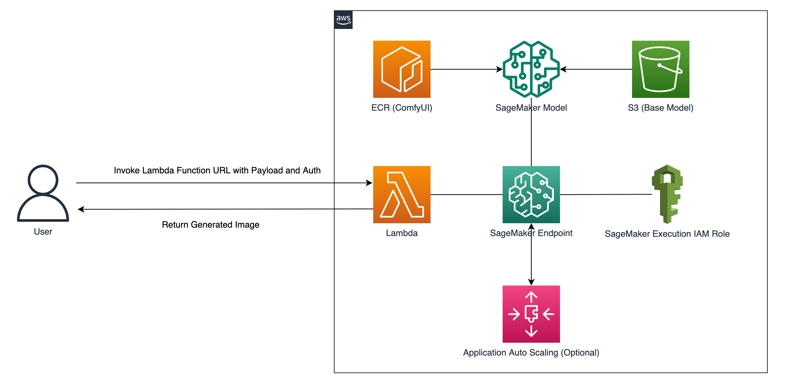
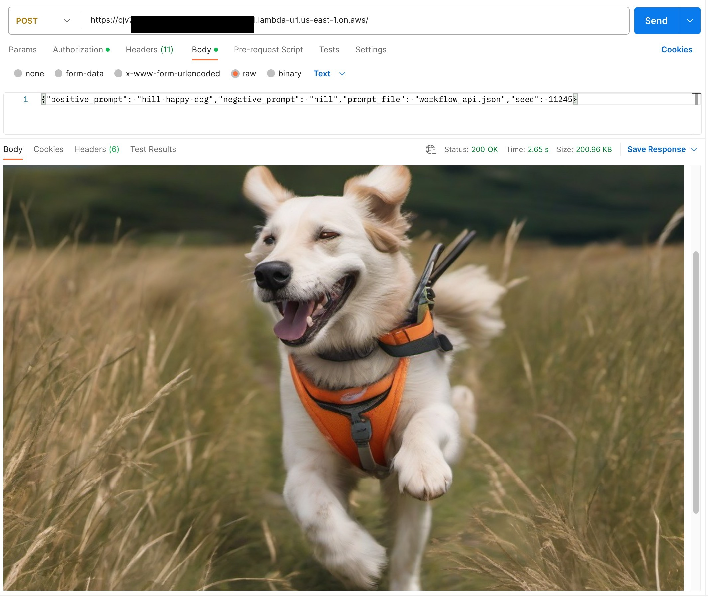

# ComfyUI on Amazon SageMaker
This project demonstrates how to generate images using Stable Diffusion by hosting ComfyUI on Amazon SageMaker Inference. It is a design pattern that allows adding GenAI image generation capability to your application.

[ComfyUI](https://github.com/comfyanonymous/ComfyUI) is one of the most popular GUI and backend that allows you to generate images using Stable Diffusion. Some of the key features:
- supports complex Stable Diffusion workflows using GUI without needing to code anything
- supports SD1.x, SD2.x, SDXL and SD3
- can load ckpt, safetensors and diffusers models
- supports Embeddings, Hypernetworks, Loras, Hires fix

By hosting ComfyUI using Amazon SageMaker Inference, it can be particularly suitable when you want to:
* self-host models and keep all your data within your AWS account and region
* intergrate text-to-image or image-to-image in your application using Stable Diffusion but no coding on PyTorch (just intergrate this pattern into your application)
* use state-of-the-art models (checkpoints, embeddings, hypernetwork, LoRA, Controlnet) from community, such as [Hugging Face](https://huggingface.co/) or [Civitai](https://civitai.com/), yet without any coding
* make use of fully managed service without taking care of setting up and managing instances, software version compatibilities, and patching versions
* use autoscaling to shut down instances when there is no usage to prevent idle capacity and reduce inference cost

## Architecture
There is a Lambda function to invoke SageMaker inference endpoint (which is running ComfyUI) for generating images. For illustration, [Lambda function URL](https://docs.aws.amazon.com/lambda/latest/dg/urls-configuration.html) is configured so you can test the image generation by calling to this dedicated HTTPS endpoint.


## Deployment Guide
### Environments
The easiest way is to launch an EC2 instance of `g5.xlarge` running AMI `Deep Learning OSS Nvidia Driver AMI GPU PyTorch 2.3.0 (Amazon Linux 2)`. Connect to the instane using **Session Manager**, then add user to group `docker` by running the following command.

```bash
sudo usermod -a -G docker $(whoami)
```

Disconnect and connect again for updated group membership to take effects.

> - If you do not run ComfyUI locally, non-gpu instance such as `t3.xlarge` also works.

[AWS Cloud9](https://console.aws.amazon.com/cloud9control) or local machine also work but make sure the followings are installed properly.
* awscli
* Docker
* pigz


### Quick Start
**Step 1** - Clone the project:
```bash
git clone https://github.com/aws-samples/comfyui-on-amazon-sagemaker.git
```

**Step 2** - Customize the following files (optional):
* **[deploy.sh](deploy.sh)** - configurations
* **[model/build.sh](model/build.sh)** - models to include (SDXL 1.0 is downloaded by default)
* **[lambda/workflow/workflow_api.json](lambda/workflow/workflow_api.json)** - workflow json for ComfyUI

**Step 3** - Run [deploy.sh](deploy.sh). It usually takes 20 to 30 minutes to complete.
```bash
./deploy.sh
```


### HTTPS Endpoint for testing
For illustration, [Lambda function URL](https://docs.aws.amazon.com/lambda/latest/dg/urls-configuration.html) is enabled so you can test the image generation by calling to this dedicated HTTPS endpoint. The endpoint URL can be found at the `ComfyUIFunctionUrl` from the stack output.


`AWS_IAM` auth is configured by default for invoking the lambda function URL, so you must sign each HTTP request using AWS Signature Version 4 (SigV4). Tools such as [awscurl](https://github.com/okigan/awscurl), [Postman](http://www.postman.com/), and [AWS SigV4 Proxy](https://github.com/awslabs/aws-sigv4-proxy) offer built-in ways to sign your requests with SigV4. You may disable the authentication by setting `LAMBDA_URL_AUTH_TYPE` to `NONE` in [deploy.sh](deploy.sh) but it is dangerious as the function URL is open to everyone.

Example of AWS Signature authorization using Postman:


And here is an example of request body:
```json
{
  "positive_prompt": "hill happy dog",
  "negative_prompt": "hill",
  "prompt_file": "workflow_api.json",
  "seed": 11245
}
```

A successful invocation seeing the image generated:


### Clean up
Delete the following resources deployed by [deploy.sh](deploy.sh).
1. CloudFormation stack (default: `comfyui`)
2. S3 bucket (default:`comfyui-sagemaker-<AWS_ACCOUNT_ID>-<AWS_REGION>`)
3. ECR repository (default:`comfyui-sagemaker`)

## Development Guide
See [DEVELOPMENT](DEVELOPMENT.md)

## Security

See [CONTRIBUTING](CONTRIBUTING.md#security-issue-notifications) for more information.

## License

This library is licensed under the MIT-0 License. See the LICENSE file.


